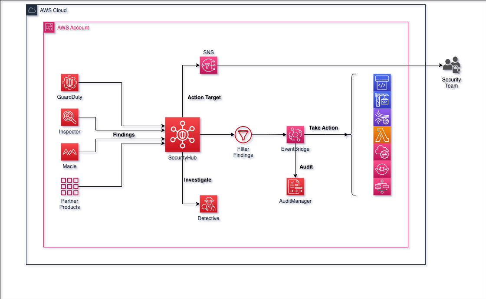
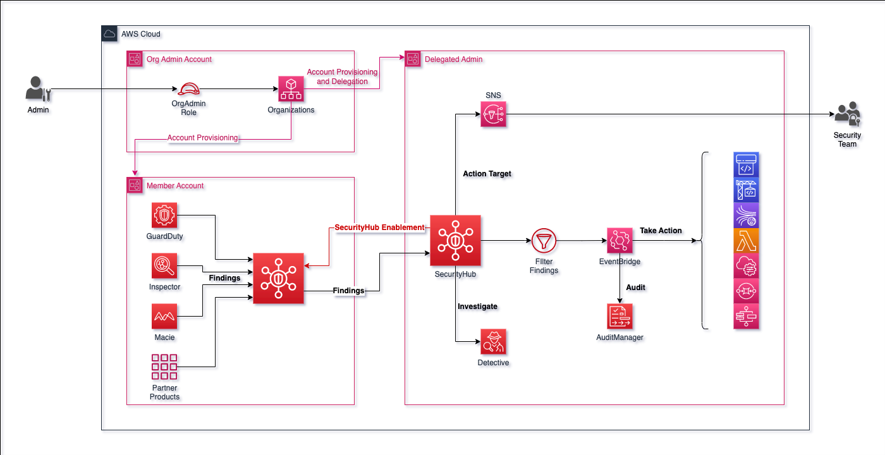

# Terraform Module for AWS Security Hub

Terraform module that creates AWS Security Hub resources.

- [Terraform Module for AWS Security Hub](#terraform-module-for-aws-security-hub)
  - [Usage](#usage)
    - [Standalone](#standalone)
    - [Organizations](#organizations)
  - [Overview Diagrams](#overview-diagrams)
    - [Standalone](#standalone-1)
    - [Organizations](#organizations-1)
  - [Terraform Module](#terraform-module)


## Usage

### Standalone

```hcl
module "security_hub" {
  source = "../../../"

  enable_default_standards  = false
  control_finding_generator = "STANDARD_CONTROL"
  auto_enable_controls      = true

  product_config = [{
    enable = true
    arn    = "arn:aws:securityhub:${data.aws_region.current.name}::product/aws/guardduty"
  }]

  standards_config = {
    aws_foundational_security_best_practices = {
      enable = true
      status = "ENABLED"
    }
    cis_aws_foundations_benchmark_v120 = {
      enable = false
    }
    cis_aws_foundations_benchmark_v140 = {
      enable = true
      status = "ENABLED"
    }
    nist_sp_800_53_rev5 = {
      enable = false
    }
    pci_dss = {
      enable = false
    }
  }

  action_target = [{
    name        = "Send to Amazon SNS"
    identifier  = "SendToSNS"
    description = "This is a custom action to send findings to SNS Topic"
  }]

}

resource "aws_securityhub_standards_control" "ensure_iam_password_policy_prevents_password_reuse" {
  standards_control_arn = "arn:aws:securityhub:${data.aws_region.current.name}:${data.aws_caller_identity.current.account_id}:control/cis-aws-foundations-benchmark/v/1.4.0/1.10"
  control_status        = "DISABLED"
  disabled_reason       = "Password policies are managed by external resource"

  depends_on = [module.security_hub]
}

resource "aws_securityhub_insight" "this" {
  filters {
    created_at {
      date_range {
        unit  = "DAYS"
        value = 7
      }
    }
    network_source_ipv4 {
      cidr = "10.0.0.0/16"
    }
    criticality {
      gte = "80"
    }
    resource_tags {
      comparison = "EQUALS"
      key        = "Environment"
      value      = "Development"
    }
  }

  group_by_attribute = "AwsAccountId"

  name = "insight"

  depends_on = [module.standalone_security_hub]
}
```

### Organizations

```hcl
module "delegated_admin" {
  source = "aws-ia/terraform-aws-security-hub/aws//modules/organizations_admin/"

  admin_account_id      = data.aws_caller_identity.current.account_id
  auto_enable_standards = "DEFAULT"
}

module "member_account" {
  source = "aws-ia/terraform-aws-security-hub/aws//modules/organizations_member/"

  providers = {
    aws        = aws
    aws.member = aws.member
  }

  member_config = [{
    account_id = "281190191734"
    email      = "required@example.com"
    invite     = false
  }]
}

module "security_hub" {
  source = "aws-ia/terraform-aws-security-hub"

  enable_default_standards  = false
  control_finding_generator = "STANDARD_CONTROL"
  auto_enable_controls      = true

  product_config = [{
    enable = true
    arn    = "arn:aws:securityhub:${data.aws_region.current.name}::product/aws/guardduty"
  }]

  standards_config = {
    aws_foundational_security_best_practices = {
      enable = true
      status = "ENABLED"
    }
    cis_aws_foundations_benchmark_v120 = {
      enable = false
    }
    cis_aws_foundations_benchmark_v140 = {
      enable = true
      status = "ENABLED"
    }
    nist_sp_800_53_rev5 = {
      enable = false
    }
    pci_dss = {
      enable = false
    }
  }

  action_target = [{
    name        = "Send to Amazon SNS"
    identifier  = "SendToSNS"
    description = "This is a custom action to send findings to SNS Topic"
  }]
}

resource "aws_securityhub_insight" "this" {
  filters {
    aws_account_id {
      comparison = "EQUALS"
      value      = "123456789012"
    }
    aws_account_id {
      comparison = "EQUALS"
      value      = "098765432109"
    }
    created_at {
      date_range {
        unit  = "DAYS"
        value = 7
      }
    }
    network_source_ipv4 {
      cidr = "10.0.0.0/16"
    }
    criticality {
      gte = "80"
    }
    resource_tags {
      comparison = "EQUALS"
      key        = "Environment"
      value      = "Development"
    }
  }

  group_by_attribute = "AwsAccountId"

  name = "insight-per-account-id"

  depends_on = [module.security_hub]
}
```

## Overview Diagrams

### Standalone



### Organizations



## Terraform Module
